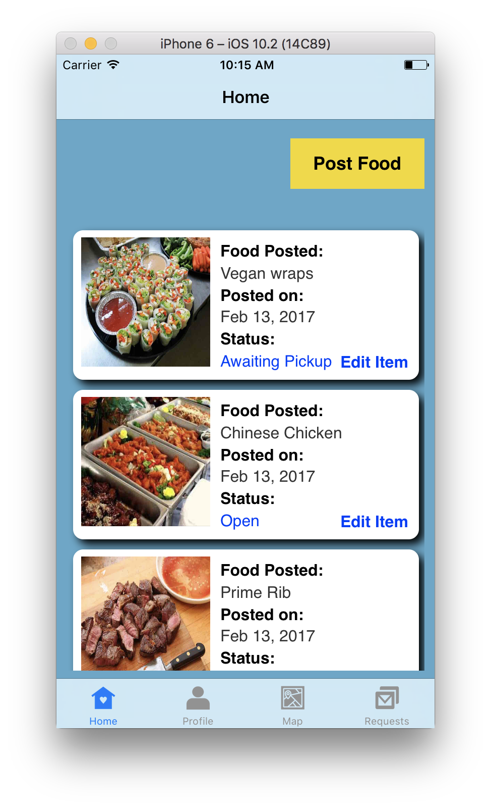
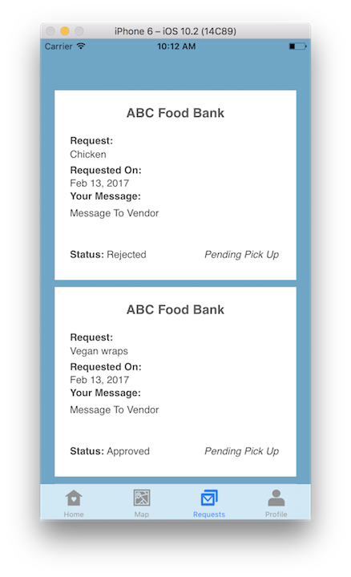
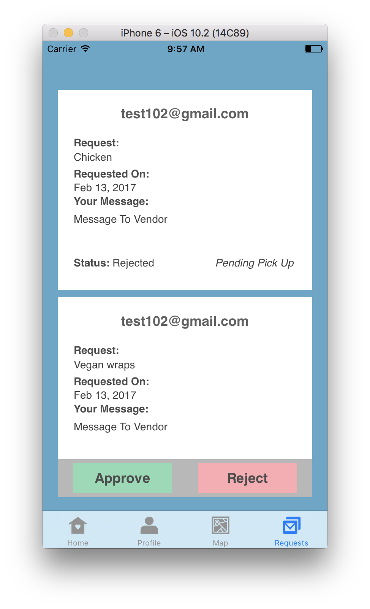

# Oliver

##Description
After an event, caterers and other food vendors often have a lot of food leftover. Unfortunately, without a simple alternative, these vendors usually end up throwing most of the extra food away. Oliver's goal is to help fight hunger by connecting food vendors with leftover food to local food banks. This offers a conveninent way for food vendors to give away excess food while providing food banks with a much needed supply of extra food. Together, we can make hunger a thing of the past.

##Screenshots
 
 

##Key Technology Used
There were many components that went into the building of Oliver. Below are a few of the key components that make things run under the hood:

* Firebase Databasing
* Location Querying
* Tab Bar Controllers
* User Authentication
* MapKit
* iPhone Native Camera Access

Cocoapods include:

	1. Intuit Location Manager
	2. Firebase Messaging
	3. Firebase Storage
	4. Firebase Database
	5. Firebase Authentication
	5. GeoFire

##Still To Come

* Many more notifications
* Vendors posts expiring based on given duration
* Users ability to set location rather than using their current location
* Interaction with Google Maps SDK
* Text input screens adjusting display to keyboard usage