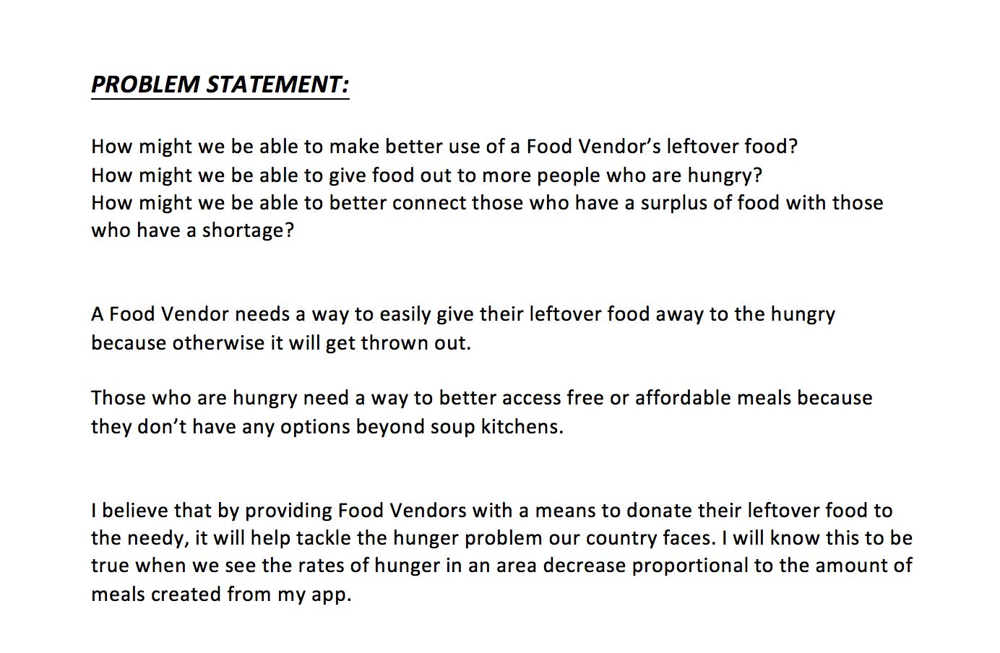
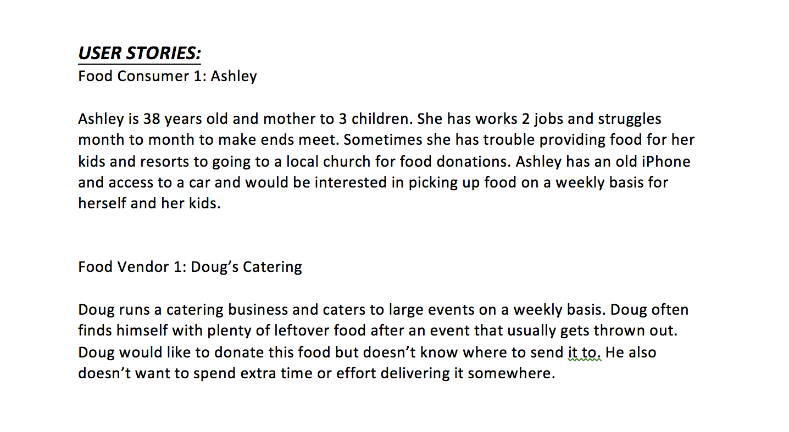
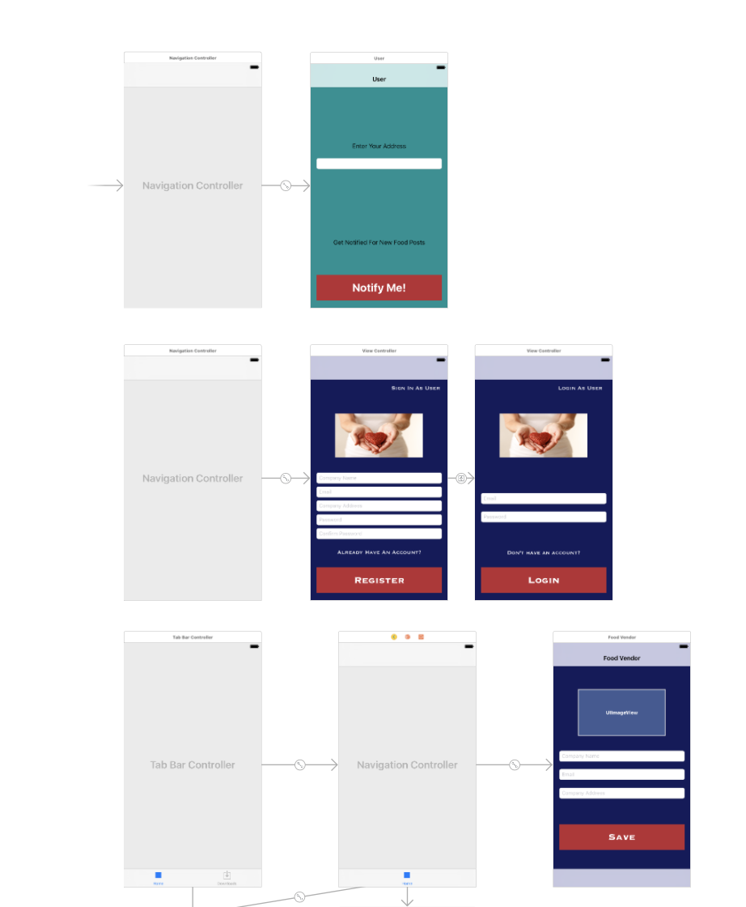

# Project-4

##Screenshots

##Description
After an event, caterers or similar food vendors, often have a lot of food leftover. Unfortunately, without a simple alternative, these vendors usually end up throwing most of the extra food away. At the same time, millions of Americans go hungry each day from a lack of food. Oliver's goal is to help fight hunger by connecting food vendors with leftover food to local food banks. This offers the food vendor a conveninent and low effort way to give away their excess food and food banks a much needed supply of extra food. Together, we can make hunger a thing of the past.

##Key Technology Used
There were many components that went into the building of Oliver. Below are a few of the key components that make things run under the hood:

* Firebase Database
* Core Location
* Tab Bar Controllers
* User Authentication
* MapKit
* iPhone Native Camera Access

Cocoapods include:

	1. Intuit Location Manager
	2. Firebase Messaging
	3. Firebase Storage
	4. Firebase Database
	5. Firebase Authentication
	5. GeoFire

##Design Process
The app's design is primarily split between the 2 types of users: Caterers and Food Banks. However, because both users interact with very similar things, the experience for each mirrors the other. Originally, I built the app in a very minimalistic fashion where each user would have a list of food postings - Caterers would see their own posts and Food Banks would see the posts of Caterers in their area. As the app grew in functionality my design evolved to meet it. 

One factor in the evolution of the design was testing. The more I would test the app the more I realized that things needed to be added. First a requests page was needed so Food Banks could easily request and reserve food posted by a Caterer. Then I had the idea to show a map of local Caterers/Food Banks in the area - this led me to shift my design pattern from just a Navigation Controller to a Tab based app. And rather than have a hamburger menu showing the user's profile, I decided to just add a tab for this as well. Halfway through the project I teamed up with a graduate of GA's UX course to sharpen the design flow and aesthetics and we continue to work together to make the best experience possible.

##Hurdles

* Only show Food Banks posts that were "Open" or not yet requested by others
* For first time users, setting up a completion that was called only after they authorized location
* Setting up a location query so only posts within a given range would be displayed

##Still To Come

* Many more notifications
* Vendors posts expiring based on given duration
* Users ability to set location rather than using their current location
* Interaction with Google Maps
* Text input screens adjusting display to keyboard usage

##Mock App Store Review
From Dan Hefter:
" I love the idea behind this app! It's great to see something that helps connect those with extra food to those who could use it most. It seems like the basics are in place but I think there's a lot more that this app can do. Would love to see it really grow!"