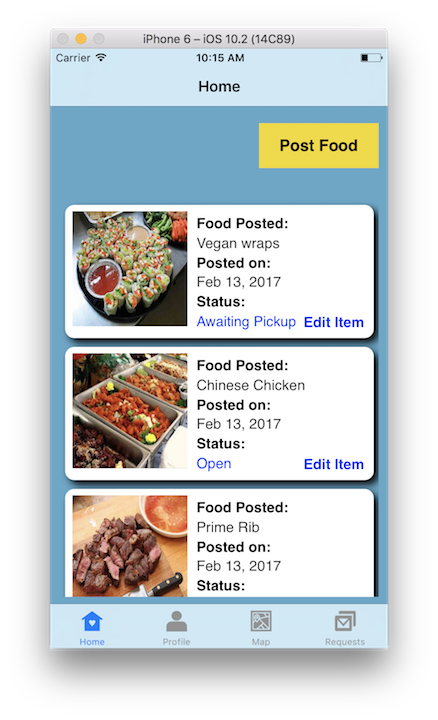
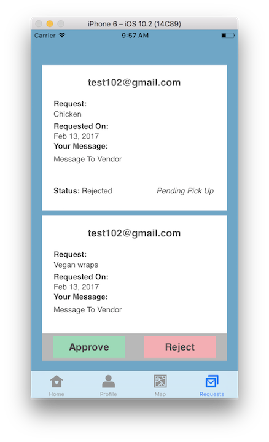

# Oliver

## Description
Oliver connects Food Vendors with leftover food to local food banks, offering a conveninent way for Food Vendors to donate their excess food. Vendors simply post the items they'd like to donate along with their location and a latest pickup time. Food Banks in a 10-mile radius can explore food posted in their area and request and item directly through the app. It offers an easy way for Food Vendors to git rid of leftover food while providing Food Banks with a much needed supply of extra food. Together, we can make hunger a thing of the past.

## Screenshots
 

## Key Features
There were many components that went into the building of Oliver. I've listed a few of the key components that make things run smoothly under the hood:

* Location Querying
	- It was important that Food Banks only see food posted within their immediate area. To accomplish this, I used a combination of Apple's CLLocation with Intuit's Location Management SDK and ran queries through Firebase's GeoFire. This allowed me to not only locate users easily, but also query my backend based on user locations.
* In-App Messaging
	- To provide an easy form of communication between a Vendor and Food Bank, I allowed Food Banks to request and message Vendors directly through the app. An item's availability changes throughout this process moving from "Open" to "Pending" to "Awaiting Pickup" in the event of an accepted request or back to "Open" if a request is rejected.
* Self refreshing data
	- In order to ensure food wasn't displayed past it's pickup time, I set my Collection Views to observe the database and check a food's deadline against the current date/time. Expired posts are automatically updated and not shown to Food Banks. 

	
Cocoapods include:

	1. Intuit Location Manager
	2. Firebase Messaging
	3. Firebase Storage
	4. Firebase Database
	5. Firebase Authentication
	5. GeoFire

## Still To Come
Oliver remains a work in progress and there are many more features and fixes still to come. Here are just a few:

* Many more notifications
* Users ability to set location rather than using their current location
* Greater usage of Google Maps SDK
* And Much More!
